# SmartSpark - Health Monitoring Application

SmartSpark is a comprehensive health monitoring mobile application built with Flutter, designed to help caregivers monitor elderly users' health status in real-time through various sensors and smart notifications. The application leverages **IoT (Internet of Things) technology** to connect wearable devices and smart sensors for continuous health data collection and analysis.

<br>

## 📱 Project Overview

SmartSpark provides a dual-user system connecting caregivers with elderly users to ensure continuous health monitoring and emergency response capabilities. The application integrates with **IoT sensors and devices** to track vital signs, medication schedules, physical activity, and provides real-time alerts for health emergencies through connected smart home systems.

<!-- ### 📸 Application Screenshots -->

<div align="center">
  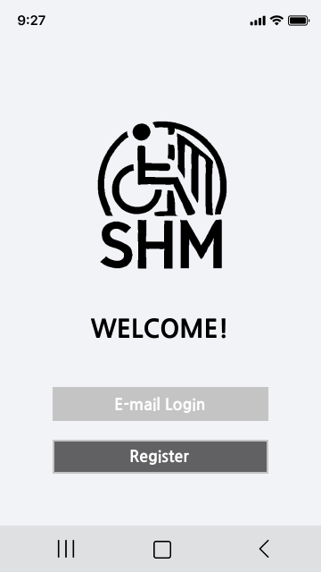
  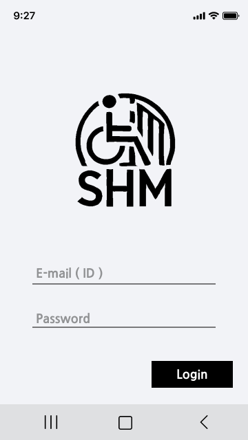
  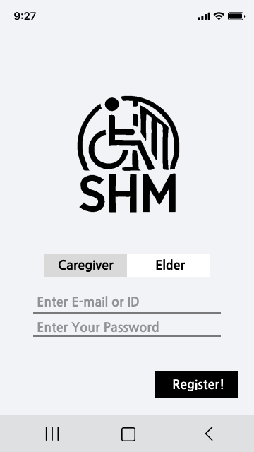
  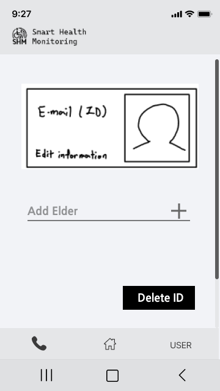
</div>

<div align="center">
  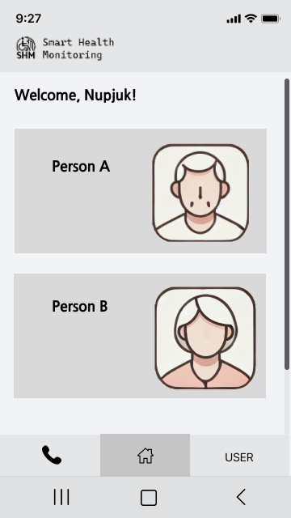
  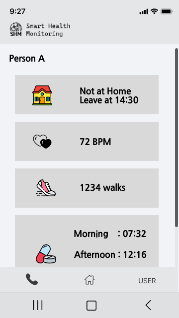
  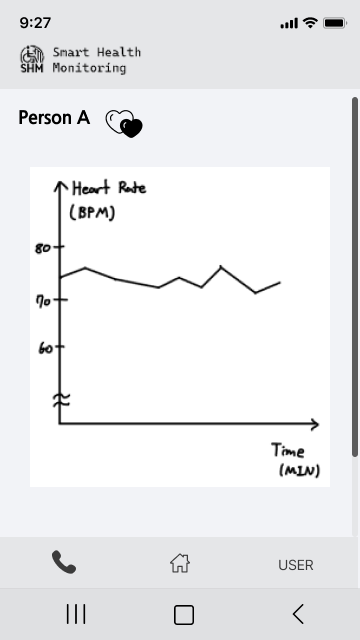
  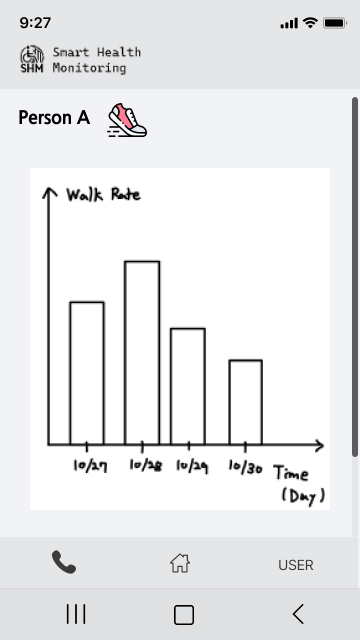
</div>

<div align="center">
  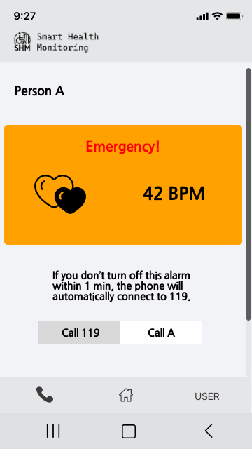
  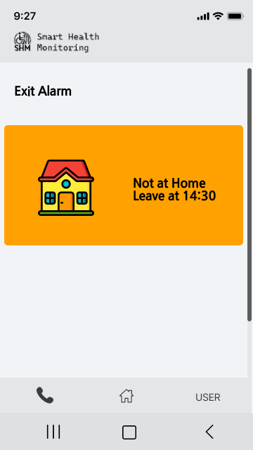
  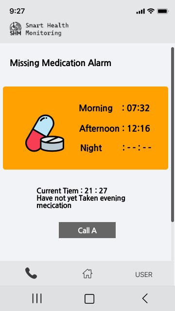
</div>

*Screenshots showing the main features: Authentication flow, health monitoring dashboard, real-time graphs, and emergency alert systems*

<br>

### Key Features

#### 🏠 **Home Dashboard**
- Real-time health status overview
- Quick access to all monitored elderly users
- Emergency contact functionality
- Push notification management

#### 👤 **User Management**
- Dual user types: Caregiver and Elderly
- Secure login and registration system
- Profile management and settings
- Multi-user monitoring capability

#### 💓 **Health Monitoring**
- **Heart Rate Tracking**: Continuous monitoring with abnormal rate alerts via IoT heart rate sensors
- **Step Counter**: Daily activity tracking through connected wearable devices and smartphone sensors
- **Medication Reminders**: Scheduled medicine alerts with smart pill dispenser integration
- **Emergency Detection**: Automatic low heart rate and outdoor emergency alerts through IoT sensor network

#### 📊 **Data Visualization**
- Interactive heart rate graphs and trends
- Daily/weekly/monthly step count charts
- Historical health data analysis
- Exportable health reports

#### 🔔 **Smart Notifications**
- Real-time Firebase push notifications
- Emergency health alerts
- Medication reminders
- Outdoor safety notifications
- Low heart rate warnings

#### 📞 **Emergency Features**
- One-touch emergency calling
- Automatic caregiver notifications
- Location-based outdoor alerts
- Health emergency detection

<br>

## 🏗️ Technical Architecture

### IoT Integration Layer
- **Wearable Devices**: Heart rate monitors, fitness trackers, and smartwatches
- **Smart Home Sensors**: Door/window sensors for outdoor monitoring
- **Environmental Sensors**: Temperature, humidity, and air quality monitoring
- **Smart Medication Dispensers**: Automated pill dispensing with consumption tracking
- **Emergency Beacons**: Panic buttons and fall detection devices

### Frontend (Flutter)
- **Framework**: Flutter 3.4.3+
- **Language**: Dart
- **State Management**: StatefulWidget with setState
- **UI Components**: Material Design 3
- **Charts**: FL Chart for data visualization
- **IoT Communication**: Real-time sensor data integration via WebSocket and REST APIs

### Backend Integration
- **API Server**: Node.js backend at `http://121.152.208.156:3000`
- **Authentication**: JWT token-based authentication
- **Real-time Communication**: Firebase Cloud Messaging (FCM)
- **Database**: RESTful API integration
- **IoT Data Processing**: Real-time sensor data aggregation and analysis
- **Device Management**: IoT device registration, monitoring, and control

### Key Dependencies
```yaml
dependencies:
  flutter: sdk: flutter
  firebase_core: ^2.5.0          # Firebase integration
  firebase_messaging: ^14.3.0    # Push notifications
  http: ^1.2.2                   # API communication
  pedometer: ^4.0.1              # Step tracking
  fl_chart: ^0.35.0              # Data visualization
  url_launcher: ^6.1.0           # External app launching
  permission_handler: ^10.0.0    # Device permissions
```


<br>

## 📱 Application Screens

### Authentication Flow
- **Welcome Screen**: Initial landing page with login/register options
- **Login Screen**: Email-based user authentication
- **Signup Screen**: New user registration with role selection

### Main Application
- **Home Screen**: Dashboard with health overview and elderly user management
- **Detail Screen**: Individual user health data and sensor readings
- **User Screen**: Profile management and settings

### Health Monitoring
- **Heart Graph**: Real-time and historical heart rate visualization
- **Steps Graph**: Daily activity and step count tracking
- **Low Heart Rate Screen**: Emergency alert interface
- **Missed Medicine Screen**: Medication reminder notifications
- **Outdoor Alert Screen**: Location-based safety notifications

<br>

## 🔧 Configuration

### API Endpoints
The application connects to the following backend endpoints:
- Authentication: `/auth/login`, `/auth/register`
- Caregiver data: `/caregiver/elderlyInfo`, `/caregiver/sensorAllData`
- Sensor data: Real-time sensor data retrieval

### Firebase Configuration
- **FCM**: Push notifications for health alerts
- **Background messaging**: Handles notifications when app is closed
- **Token management**: Secure authentication token handling

### Permissions Required
- **Activity Recognition**: For step counting
- **Phone**: For emergency calling
- **Notifications**: For health alerts
- **Internet**: For API communication

<br>

## 🎯 User Roles

### Caregiver
- Monitor multiple elderly users
- Receive real-time health alerts
- Access detailed health analytics
- Emergency contact capabilities
- Medication tracking oversight

### Elderly User
- Personal health dashboard
- Step counting and activity goals
- Medication reminders
- Emergency assistance access
- Health data privacy controls

<br>

## 🔒 Security Features

- JWT-based authentication
- Secure API communication
- Encrypted token storage
- Role-based access control
- Privacy-focused data handling

<br>

## 📈 Monitoring Capabilities

### Health Metrics
- Heart rate variability tracking
- Daily step count and activity levels
- Medication adherence monitoring
- Emergency response times
- Location-based safety alerts

<br>

## 🌐 IoT Features & Capabilities

### Connected Devices
- **Wearable Health Monitors**: Real-time heart rate and activity tracking
- **Smart Home Integration**: Door sensors for exit/entry monitoring
- **Environmental Monitoring**: Room temperature and air quality sensors
- **Emergency Devices**: Panic buttons and fall detection wearables
- **Smart Pill Dispensers**: Automated medication management with alerts

### IoT Data Processing
- **Real-time Streaming**: Continuous sensor data collection and processing
- **Edge Computing**: Local data processing for immediate emergency response
- **Cloud Analytics**: Historical data analysis and pattern recognition
- **Device Synchronization**: Multi-device coordination for comprehensive monitoring
- **Predictive Analytics**: AI-powered health trend analysis from IoT data

### Smart Home Integration
- **Automated Alerts**: Smart speaker announcements for medication reminders
- **Emergency Response**: Automatic door unlocking during emergencies
- **Activity Monitoring**: Room-by-room presence detection
- **Environmental Control**: Automated climate adjustments based on health data

### Alert Systems
- Abnormal heart rate detection via IoT sensors
- Missed medication notifications from smart dispensers
- Outdoor emergency alerts through door/window sensors
- Low activity warnings from wearable devices
- Emergency contact activation through panic buttons

<br>

## 🛠️ Development

### Project Structure
```
lib/
├── main.dart                    # Application entry point
├── welcome_screen.dart          # Landing page
├── login_screen.dart           # User authentication
├── signup_screen.dart          # User registration
├── home_screen.dart            # Main dashboard
├── detail_screen.dart          # Individual user details
├── user_screen.dart            # Profile management
├── heart_graph.dart            # Heart rate visualization
├── steps_graph.dart            # Activity tracking charts
├── low_heart_rate_screen.dart  # Emergency alerts
├── missed_medicine_screen.dart # Medication reminders
├── outdoor_alert_screen.dart   # Safety 
├── [SmartSpark] SRS_final.pdf  # SRS of this project
├── [SmartSpark] SDD_final.pdf  # SDD of this project
└── outdoor_alert_screen.dart   # Safety notifications
```

<br>

## 📝 Documentation

- **SRS Document**: Software Requirements Specification
- **SDD Document**: Software Design Document
- **API Documentation**: Backend integration guide

<br>

## 📄 License

This project is part of CS350 (Introduction to Software Engineering) term project.

<br>

## 👥 Team SmartSpark

### 👨‍💻 Contributors
- **Inho Jung** (20190605) - Team Leader & IoT Device Communication & Sensor Integration & SRS/SDD Documentation
- **Cheol-Un Mun** (20180222) - Backend Development & API Management & Data Storage  
- **Seongje Cho** (20200606) - Data Processing & Data Analysis & Backend Development
- **JongKook Han** (20220731) - Frontend Development & Application Build & Screen Configuration & Scrum Master

### 📚 Project Information
- **Project Course**: CS350 - Introduction to Software Engineering
- **Semester**: Fall 2024
- **Institution**: KAIST

